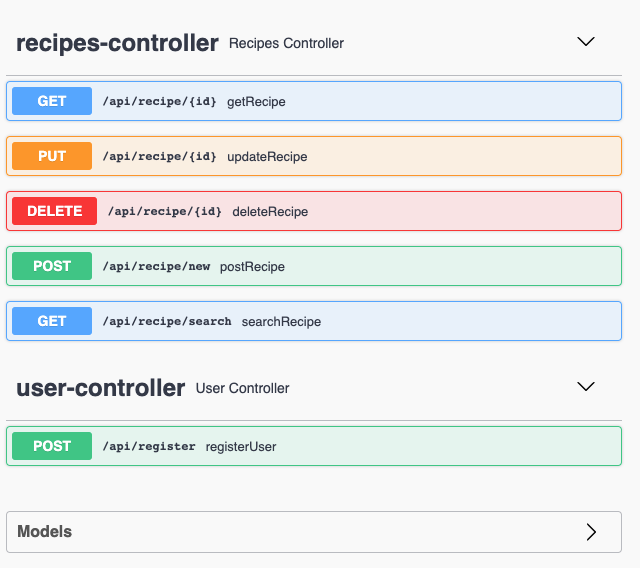

# Spring Boot - Recipes
### Small local project utilizing the power of Spring-Boot
This project features:
- JSON's
- REST API
- H2 database
- Data validation
- Using LocalDateTime
- Spring Boot security
- Swagger UI

The project uses a persistent H2 database with default configurations to maintain the data. <br />
Recipes exposes the following API endpoints: <br />

## Recipes controller
Method | Endpoint | Description
-------| ---------| -----------|
GET	| /api/recipe/{id} | Returns JSON representation of Recipe model. <br/> [Path variable] id - Dynamic id provided at insertation to the DB using POST endpoint.
PUT | /api/recipe/{id} | Updates existing Recipe entry. <br />[Path variable] id - Dynamic id provided at insertation to the DB using POST endpoint. <br />Checks if entry exists before updating, if not exist returns 404 status code.
DELETE | /api/recipe/{id} | Deletes entry from the DB. <br />[Path variable] id - Dynamic id provided at insertation to the DB using POST endpoint. <br />Returns 204 status code on success.
POST | /api/recipe/new | Saving new entry of Recipe model to the DB, after validation of the parameters received as part of the request body. <br/>On success returns 200 status code and JSON with the appointed new id.
GET | /api/recipe/search | Returns sorted list of recipes based on their last updated date. <br />Provides two options (only one applicable on each request): <br /> 1. Category - search by category name. <br /> 2. Name - search by names that **contain** the string provided (case insensitive)


## User controller
The user controller is part of **spring boot security** implementation.

Method | Endpoint | Description
-------| ---------| -----------|
POST | /api/register | Register new user <br /> ```{ "email": "string", "password": "string" }``` <br/> Both of the variables validated: <br /> - Email - contains `@` and `.` . <br /> - Password - contains minimum of 8 characters.

### Spring security
The use of security implemented to prevent from user that is **not the author** of a recipe to be able to **update or delete** a recipe that is already in the DB. <br />Each new recipe that is added to the DB is recorded with the authorization that provided the recipe.


### Swagger UI


Added Swagger UI usage to comfortablly show all the endpoints and models.
Can be found at:
> http://localhost:9090/swagger-ui/

The port is set to `9090` at the `application.properties` file, can be easily changed.


<br/><br>
###### This project based on the materials from JetBrains/hyperskill course 